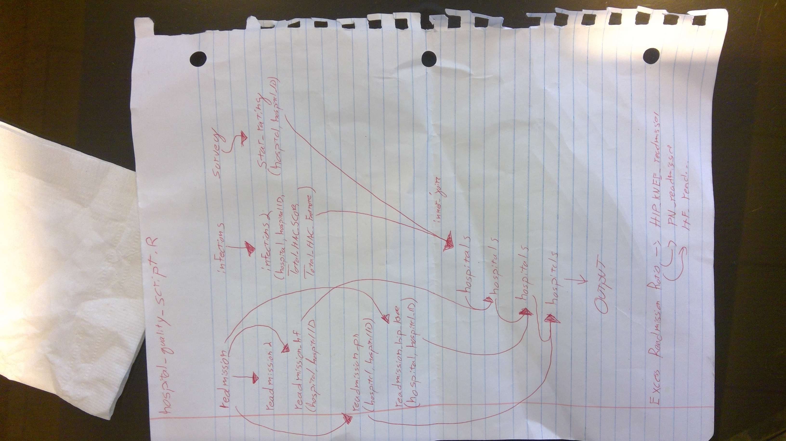

# 201901-hospitalquality

## Steve's notes

* The last three inner-joins, on lines 60-64, look like consolidation of data sources, but what this operation is trying to achieve is a *spread* via inner-joining multiple tables. This is a nice example of how journalists are doing *split, compute, and merge* with multiple tables to accomplish something that could theoretically be done with one table.

